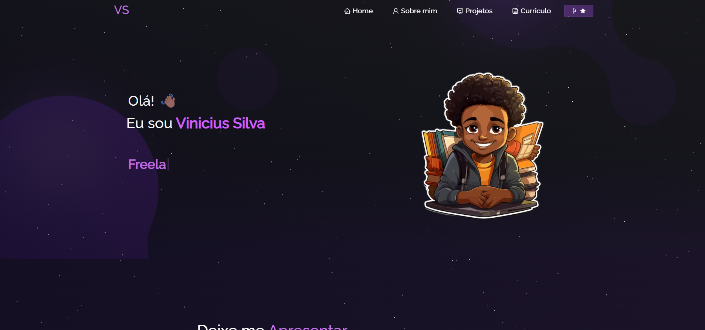

<h2 align="center">
  Portfolio Website - v2.0 
  
</h2>

 

 

## Built With

Gostaria de apresentar meu 2° Portifolio, após finalizar mau curso na Ebac na parte de front end e finalizar o modulo de React decidi atualizar meu portifolio e incluir meus melhores projetos. 

Este projeto foi construído usando essas tecnologias.

- React.js
- Node.js
- CSS
- VsCode
- Vercel

## 🛠 Installation and Setup Instructions

1. Installation: `npm install`

2. In the project directory, you can run: `npm start`

Runs the app in the development mode.\
Open [http://localhost:3000](http://localhost:3000) to view it in the browser.
The page will reload if you make edits.

## Usage Instructions

Open the project folder and Navigate to `/src/components/`.  
You will find all the components used and you can edit your information accordingly.

